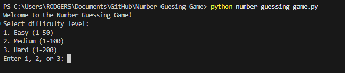
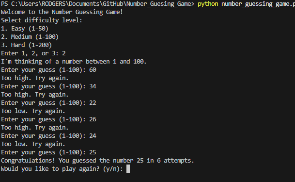
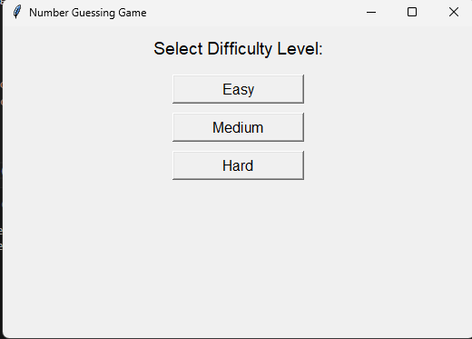
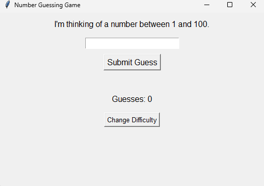

# Number Guessing Game

A simple and fun game where the computer selects a random number and you try to guess it! Available in both console and GUI versions.

## Features
- Random number generation
- User input with hints ("too high" or "too low")
- Guess counter
- Replay option
- Difficulty levels: Easy (1–50), Medium (1–100), Hard (1–200)
- GUI version with Tkinter (difficulty selection, hints, guess count, replay, and exit)

## How to Run

### Console Version
1. Make sure you have Python installed (version 3.x).
2. Open a terminal in this folder.
3. Run:
   ```bash
   python number_guessing_game.py
   ```

### GUI Version
1. Make sure you have Python installed (version 3.x).
2. Tkinter is included with most Python installations. If not, install it via your package manager.
3. Open a terminal in this folder.
4. Run:
   ```bash
   python number_guessing_game_gui.py
   ```

## Images

- 
- 

- 
- 

## Videos

- [Gameplay Demo](videos/Number_Guesing_game.mp4)

## License
MIT 